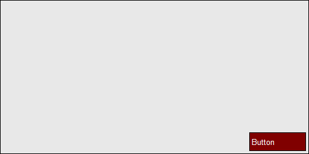
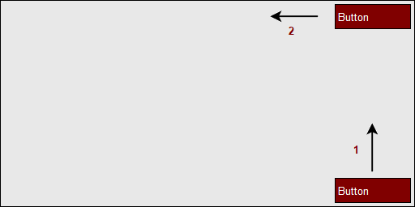
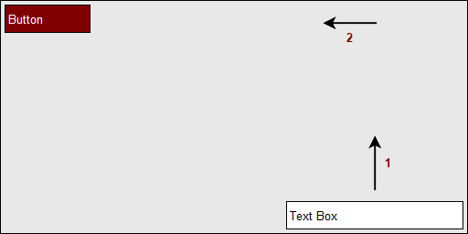

# Fl_Flow
## A fast and fun layout manager for FLTK

Fl_Flow is a layout manager for FLTK which works in a largely
different manner to existing systems you may have encountered so
far. However it is intended to simplify the UI development process
and provide a much smoother workflow for both initial development
as well as future maintenance.

## Simple tutorial

Lets have a look at how Fl_Flow works and what kinds of functionality
it provides. The first step is to create a minimal program displaying
a single window with a button. This can be done using the following
code:

```
#include <FL/Fl_Double_Window.H>
#include <FL/Fl_Button.H>
#include <FL/Fl_Flow.H>

int main()
{
  Fl_Double_Window win(640, 480);
  Fl_Flow flow(0, 0, win.w(), win.h());
  Fl_Button button(0, 0, 100, 30, "Button");

  win.resizable(flow);
  win.show();

  return Fl::run();
}
```
The program can be compiled as a normal C++ FLTK program using a
command similar to:

    $ c++ main.cpp -lfltk

This would result in a window appearing with the following layout.



You will notice that by default the button will appear at the bottom
right corner of the window if no positional instructions are given.
This may seem strange at first (i.e other systems default to the
top left) however after you start to use the system you may start
to see that it offers a few conveniences.

Our next step is to move the button to the top left. Rather than
set absolute coordinates (such as 0, 0), Flow works using instructions.
So as the window is resized, these same instructions get rerun and
the window layout is regenerated (albeit at a different size). For
now we just move up via the following code:

    flow.add(button, "^");

As you may have guessed, directions are given within the WidgetFlow
function via < > ^ v symbols. As the following image demonstrates,
the button will keep moving upwards until it hits either the edge
of the window or another positioned Widget.


With that in place, we can then instruct the Widget to move to the
left. Rather than writing multiple statements in C, the command can
be collapsed as seen in the following code:

    flow.add(button, "^<");

So with this, the button will first move all the way to the top
edge, and then all the way to the left edge as shown in the following:



With this in place, we will now create a new Text Box and provide
it the same instructions to move up and left. This will place it
neatly beside the original button. You will see that if we swap the
instructions and move it left first and then up, it will result in
being placed under the original button. This provides useful
flexibility. The code for the Text Box should be as follows.

```
Fl_Input text(0, 0, 150, 30);
flow.add(text, "^<");
```

The following image shows the route that the Text Box will take.
This should also be fairly easy to visualize compared to other
approaches using many nested grid containers.



Next we are going to add a separator widget to close off the top
row. For this we are going to do something slightly different.
Instead of moving to the left, we provide an instruction for the
Widget to expand left. this means it will keep growing towards the
left until it touches the left edge. After this our usual instruction
to move upwards is given.

```
Fl_Box sep(0, 0, 1, 1);
sep.color(FL_BLACK);
sep.box(FL_FLAT_BOX);
flow.add(sep, "=<^");
```

So again, you may notice that any directional instruction with a =
symbol before it will expand in that direction rather than simply
move. This process is demonstrated by the following image.


Note that the Separator Widget is by default 1x1 pixels in size.
This allows us to expand it in the vertical direction as well as
horizontal. The final result of this can be seen in the following
image.


At this point, our code should be similar to the following:

```
#include <FL/Fl_Double_Window.H>
#include <FL/Fl_Button.H>
#include <FL/Fl_Flow.H>
#include <FL/Fl_Input.H>
#include <FL/Fl_Box.H>

int main()
{
  Fl_Double_Window win(640, 480);
  Fl_Flow flow(0, 0, win.w(), win.h());
  Fl_Button button(0, 0, 100, 30, "Button");
  Fl_Input text(0, 0, 150, 30);
  Fl_Box sep(0, 0, 10, 1);
  sep.color(FL_BLACK);
  sep.box(FL_FLAT_BOX);
 
  flow.add(button, "^<");
  flow.add(text, "^<");
  flow.add(sep, "=<^");

  win.resizable(flow);
  win.show();

  return Fl::run();
}
```

